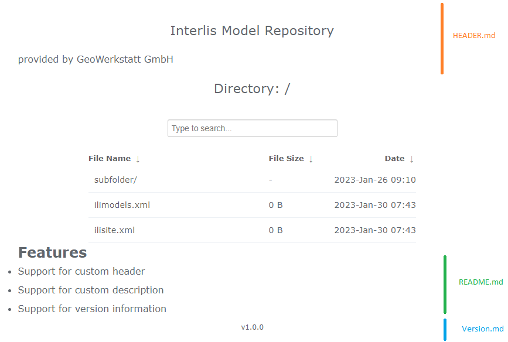

# INTERLIS Model Repository
This repository contains dockerized tools to validate and host a INTERLIS Model Repository compatible with [ilivalidator](https://github.com/claeis/ilivalidator).

## Create repository structure
The following repository structure is required by many INTERLIS-Tools to work. This documentation assumes given structure.
```
repository-root
├── folder-with-ili-or-catalogs
│   ├── *.ili
│   └── *.xml
├── ilimodels.xml
├── ilisite.xml
└── (ilidata.xml)
```

## Validate repository
Currently the validation process is not dockerized or automated. You can use [ili2c](https://www.interlis.ch/downloads/ili2c) to validate your repository structure.

Invoke ili2c as follows replacing `root` with your repository's root directory.

```
java -jar ili2c.jar --modeldir "root;http://models.interlis.ch" --check-repo-ilis root
```

## Host repository
The docker image `interlis-model-repository` provides a preconfigured nginx instance with themed [ngx-fancyindex](https://github.com/aperezdc/ngx-fancyindex) module activated. The theme is based on [Nareen's theme](https://github.com/Naereen/Nginx-Fancyindex-Theme) and provides some extra's tailored for hosting an INTERLIS Repository.

### Minimal setup with compose:
Run the provided compose within your [correctly structured Repository](#create-repository-structure)
```
version: "3.3"
services:
  repository:
    image: interlis-model-repository:latest
    volumes:
      - .:/data:ro
    ports:
      - "80:80"
```
### Providing version information
__Attention: `Version.md` is excluded in visual representation of the index.__ 

Version information can be provided within the `Version.md` file in the Repository root. The contents are translated to html and are show below the footer. 

### Adaptation of theme
The image allows to override the included theme or configure the displayed text in header and footer with markdown. Extend the docker-compose file accordingly. The markdown capabilities are provided by [Nareen's theme](https://github.com/Naereen/Nginx-Fancyindex-Theme).:
```
volumes:
 - ./Custom-header.md:/theme/HEADER.md  #Override the contents of the header.
 - ./Custom-footer.md:/theme/README.md  #Override the contents of the footer.
```

Replace the included theme by overriding / mounting the contents of `/theme` within the container. The [ngx-fancyindex](https://github.com/aperezdc/ngx-fancyindex) is configured to load `/theme/header.html` as header, respectively `/theme/footer.html` as footer. The contents of `/theme` are served within the `/theme`-subroute.

### Adaptation of nginx config
The image functions like regular [nginx docker image](https://hub.docker.com/_/nginx) apart default configuration and included [ngx-fancyindex](https://github.com/aperezdc/ngx-fancyindex). For configuring please refer to official [nginx documentation](http://nginx.org/en/docs/) and our config files [nginx.conf](./repository/nginx.conf) and [default.conf.template](./repository/default.conf.template).




